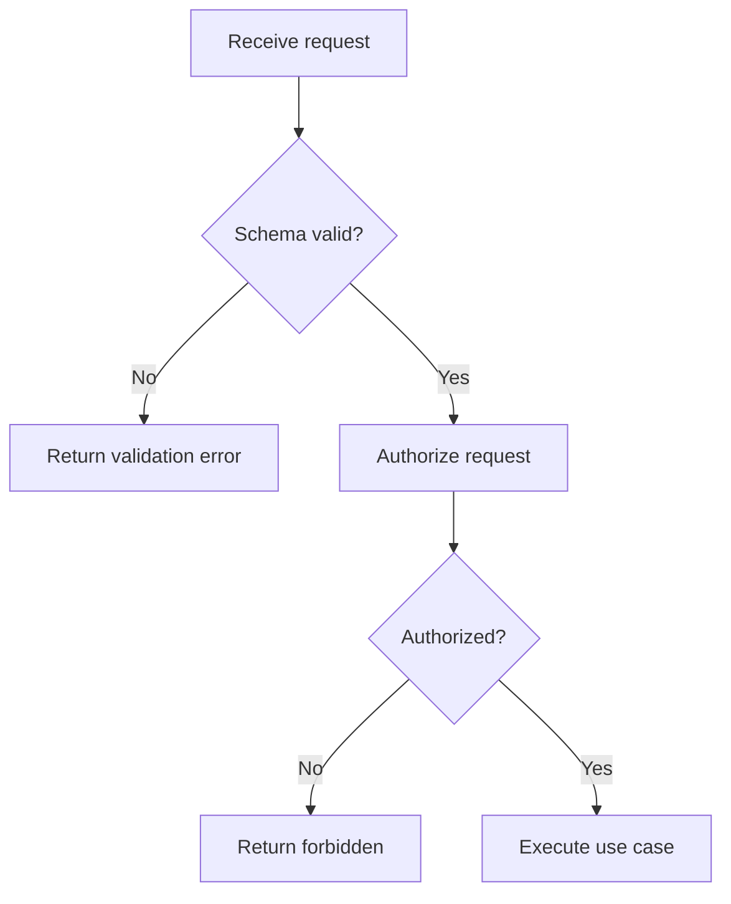
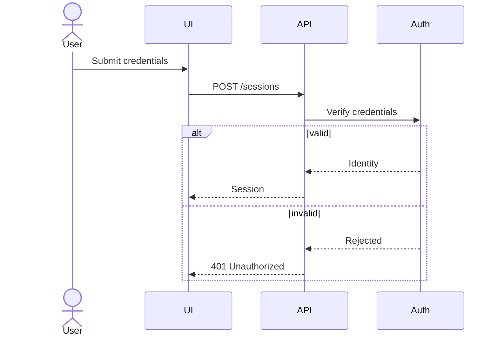
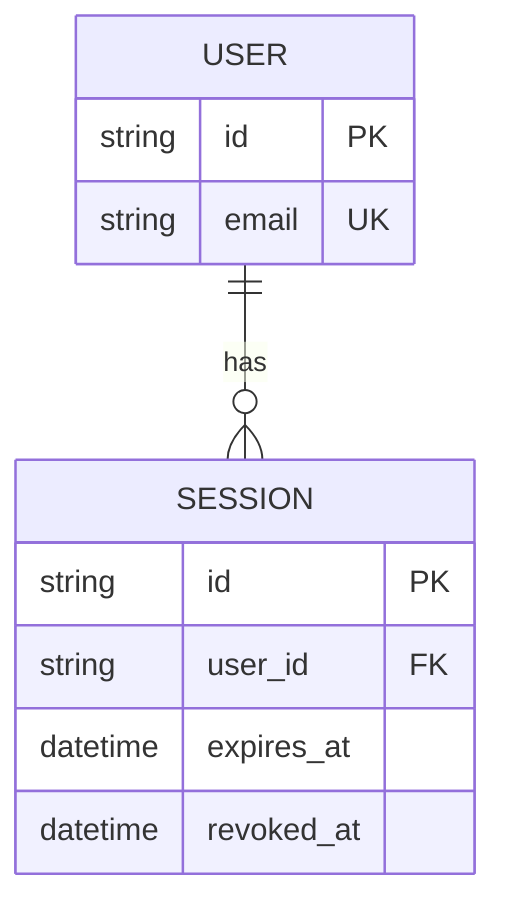
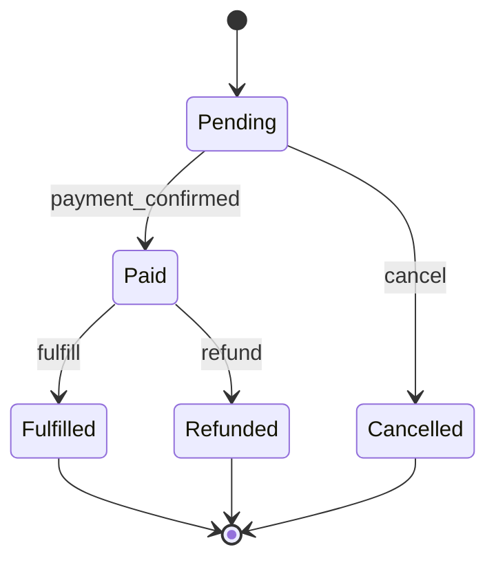
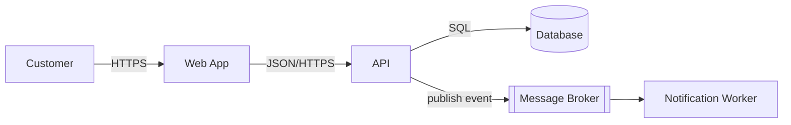

# Compact Examples

These are patterns, not universal templates.

## Flowchart — validation pipeline

## Sequence — login

## ERD — users and sessions

## State — order lifecycle

## Architecture — lightweight C4-like view

Use a true C4 notation when explicit C4 semantics are required.
